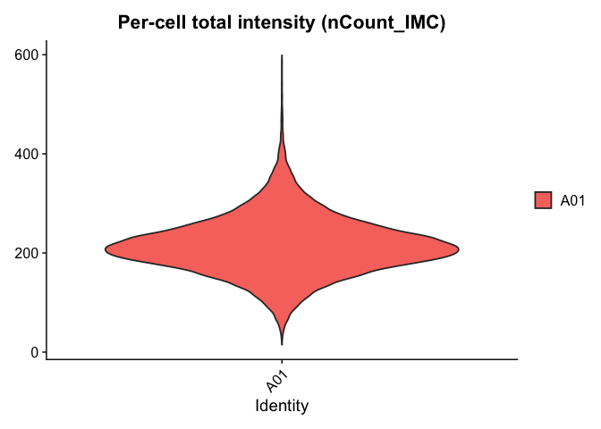
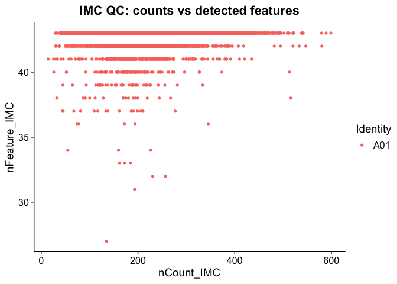
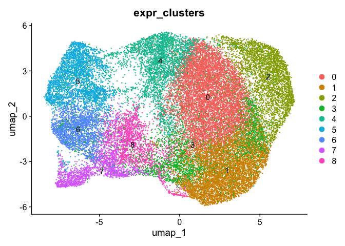
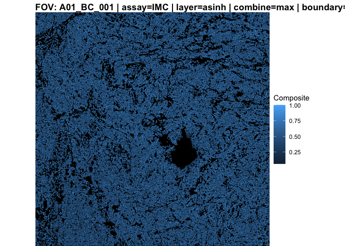
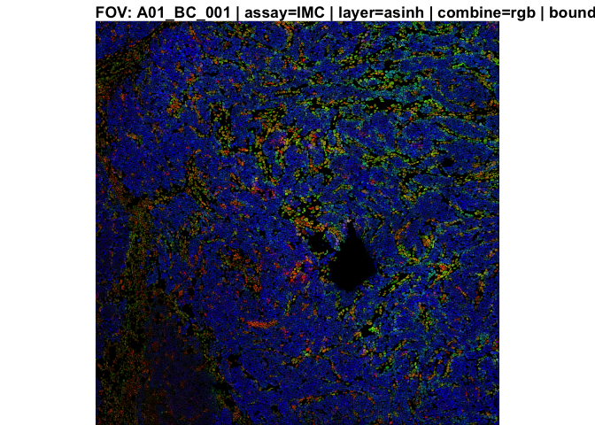
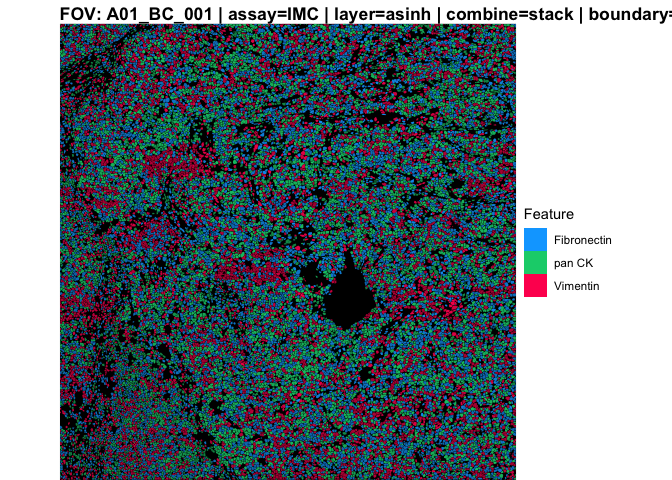

<!-- README.md is generated from README.Rmd. Please edit that file -->

# IMCLoadR 

IMCLoadR provides Seurat v5–friendly loaders and plotting helpers for
Imaging Mass Cytometry (IMC) data exported from MCD Viewer (MCDV)
workspaces after cell segmentation.

The package focuses on: - Building one Seurat v5 object per FOV from a
MCDV workspace: – Expression stored in a dedicated assay (default: IMC)
– Optional `asinh` layer – Spatial centroids and (optionally)
segmentation polygons from label masks - Storing provenance and spatial
metadata in the Seurat tools slot – Simple visualization helpers for
plotting IMC intensities over segmentation or centroids

-The two main user-facing functions are:

- `LoadIMCSegmented()` – build Seurat v5 objects from an IMC workspace
- `IMCFovPlot()` – flexible overlay plot for FOVs
  (segmentation/centroids, max/rgb/stacked composites)

The package is MIT-licensed.

# Installation

`IMCLoadR` is currently developed on GitHub.

``` r
# install.packages("remotes")  # or devtools, if you prefer
remotes::install_github("m-a-carpenter/IMCLoadR")
```

Once installed:

``` r
library(IMCLoadR)
library(Seurat)
#> Loading required package: SeuratObject
#> Loading required package: sp
#> 'SeuratObject' was built under R 4.5.0 but the current version is
#> 4.5.1; it is recomended that you reinstall 'SeuratObject' as the ABI
#> for R may have changed
#> 
#> Attaching package: 'SeuratObject'
#> The following objects are masked from 'package:base':
#> 
#>     intersect, t
library(SeuratObject)
```

Optional, but recommended for full functionality:

``` r
# Enable additional features:
# - terra/sf: segmentation polygon reconstruction
# - magick: mask/background images
# - dplyr, ggplot2, scales: plotting and summaries
install.packages(c(
  "terra", "sf", "magick",
  "ggplot2", "dplyr", "scales"
))
#> Installing packages into '/private/var/folders/2m/_lnd32td6wjd9yrjmbcj9v2c0000gq/T/RtmpYn3qgl/temp_libpath5ec66279b1c'
#> (as 'lib' is unspecified)
#> 
#> The downloaded binary packages are in
#>  /var/folders/2m/_lnd32td6wjd9yrjmbcj9v2c0000gq/T//RtmpBEfw9u/downloaded_packages
```

# Expected input: MCDV workspace layout

`LoadIMCSegmented()` expects a top-level workspace directory exported
from MCDV after segmentation, with a structure similar to:

WorkSpace_010/ CellSegmentation/ IMC-Sample-Tissue/ A01_BC_001/
SingleCellObjects.csv Cell_mask.tiff A02_BC_002/ SingleCellObjects.csv
Cell_mask.tiff … tiff_multi_page_export/ IMC-Sample-Tissue/ A01_BC_001/
A01_BC_001.ome.tiff A01_BC_001.ome.xml before_ablation.png
after_ablation.png A01_BC_001_01_Panorama_001.png …

The loader:

- Reads per-cell CSVs (SingleCellObjects.csv)
- Uses the mask TIFF (Cell_mask.tiff) as a label map (if present) to
  reconstruct segmentation polygons
- Optionally reads OME metadata for pixel size (if XML exists)
- Creates one Seurat object per FOV, with assay + spatial data attached

# Quick start

## Example data

The vignette and tests are designed to work with a small toy workspace
shipped under inst/extdata in the package.

``` r
library(IMCLoadR)
library(Seurat)
library(SeuratObject)
library(ggplot2)

topdir <- system.file("extdata/wsmin", package = "IMCLoadR")
topdir
#> [1] "/private/var/folders/2m/_lnd32td6wjd9yrjmbcj9v2c0000gq/T/RtmpYn3qgl/temp_libpath5ec66279b1c/IMCLoadR/extdata/wsmin"
```

If this returns a non-empty path, you can run the full example locally.
If you have your own workspace on disk, simply set topdir to that path
instead.

## Load IMC data into Seurat v5 objects

``` r
objs <- LoadIMCSegmented(
  top_dir                      = topdir,
  keep_unlabeled_channels      = FALSE,
  add_asinh_layer              = TRUE,
  asinh_cofactor               = 5,
  build_segmentation_from_mask = TRUE,
  default_boundary             = "segmentation",
  verbose                      = TRUE,
  spatial_rotate_k             = 3    # rotate by 270° for slide alignment
)
#> Found 1 FOV csv(s).
#> Mask 'Cell_mask.tiff': unique=34270, cells=34272, integerish=1.000, dense_ok=TRUE -> labelmap=TRUE
#> Built FOV 'A01_BC_001': 34272 cells, 43 features.

length(objs)        # one Seurat object per FOV
#> [1] 1
names(objs)
#> [1] "A01_BC_001"
```

## Pick one FOV to work with:

``` r
obj   <- objs[[1]]
assay <- DefaultAssay(obj)         # usually "IMC"
fov   <- SeuratObject::DefaultFOV(obj)

assay
#> [1] "IMC"
fov
#> [1] "A01.BC.001"
```

# What the loader adds

## Assay + layers

By default, `LoadIMCSegmented()`:

- Creates an assay (default: “IMC”)
- Stores expression in the counts layer
- Optionally adds an asinh layer derived from counts

``` r
SeuratObject::Layers(obj[[assay]])
#> [1] "counts" "asinh"
```

You can then use Seurat v5’s layer-aware functions downstream
(`NormalizeData`, `ScaleData`, `FindAllMarkers`, etc.) with
`layer = ...`.

## Metadata and QC

The loader writes cell-level QC into meta.data, including: - `cell_id`,
`centroid_x`, `centroid_y` - `cell_area_um2` (if available / computed) -
`nCount_IMC`, `nFeature_IMC` (from the chosen layer)

``` r
head(obj@meta.data[, c("cell_id", "centroid_x", "centroid_y",
                       "cell_area_um2", "nCount_IMC", "nFeature_IMC")])
#>              cell_id centroid_x centroid_y cell_area_um2 nCount_IMC
#> A01_BC_001_1       1   7.555556  1.0740741            27   239.1481
#> A01_BC_001_2       2  46.150000  1.1750000            40   257.8500
#> A01_BC_001_3       3  55.352941  0.9411765            17   221.0588
#> A01_BC_001_4       4 119.500000  2.3500000            40   206.0250
#> A01_BC_001_5       5 135.325000  1.3250000            40   186.2250
#> A01_BC_001_6       6 158.904762  1.8571429            42   232.0952
#>              nFeature_IMC
#> A01_BC_001_1           43
#> A01_BC_001_2           43
#> A01_BC_001_3           43
#> A01_BC_001_4           43
#> A01_BC_001_5           43
#> A01_BC_001_6           43
```

Common QC views:

``` r
VlnPlot(obj, features = "nCount_IMC", layer = "counts", pt.size = 0) +
  ggtitle("Per-cell total intensity (nCount_IMC)")
```



``` r

FeatureScatter(
  obj,
  feature1 = "nCount_IMC",
  feature2 = "nFeature_IMC"
) + ggtitle("IMC QC: counts vs detected features")
```



## Spatial information in the tools slot

`LoadIMCSegmented()` stores provenance and spatial metadata in the
Seurat tools slot under “LoadIMCSegmented”, for example:

- Paths: – `top_dir`, project name, FOV name – Single-cell CSV path,
  mask path, panorama image path, OME TIFF
- Scale factors: – Pixel dimensions (width/height) – Micron-per-pixel
  estimates from OME metadata
- Spatial orientation: – `rotate_k`, center (`cx`, `cy`)
- Segmentation coordinates: – Raw polygon coordinates per FOV (if
  segmentation was built)

You can examine these via:

``` r
tool <- SeuratObject::Tool(obj, "LoadIMCSegmented")
str(tool, max.level = 1)
#> List of 7
#>  $ paths              :List of 7
#>  $ feature_meta       :List of 1
#>  $ scale_factors      :List of 2
#>  $ spatial_orientation:List of 2
#>  $ transforms         :List of 1
#>  $ provenance         :List of 5
#>  $ segmentation_coords:List of 1
```

or for a specific component, e.g.:

``` r
tool$paths
#> $top_dir
#> [1] "/private/var/folders/2m/_lnd32td6wjd9yrjmbcj9v2c0000gq/T/RtmpYn3qgl/temp_libpath5ec66279b1c/IMCLoadR/extdata/wsmin"
#> 
#> $project
#> [1] "IMC-Sample-Tissue"
#> 
#> $fov
#> [1] "A01_BC_001"
#> 
#> $single_cell_csv_path
#> [1] "/private/var/folders/2m/_lnd32td6wjd9yrjmbcj9v2c0000gq/T/RtmpYn3qgl/temp_libpath5ec66279b1c/IMCLoadR/extdata/wsmin/CellSegmentation/IMC-Sample-Tissue/A01_BC_001/SingleCellObjects.csv"
#> 
#> $cell_mask_path
#> [1] "/private/var/folders/2m/_lnd32td6wjd9yrjmbcj9v2c0000gq/T/RtmpYn3qgl/temp_libpath5ec66279b1c/IMCLoadR/extdata/wsmin/CellSegmentation/IMC-Sample-Tissue/A01_BC_001/Cell_mask.tiff"
#> 
#> $panorama_png_path
#> [1] "/private/var/folders/2m/_lnd32td6wjd9yrjmbcj9v2c0000gq/T/RtmpYn3qgl/temp_libpath5ec66279b1c/IMCLoadR/extdata/wsmin/tiff_multi_page_export/IMC-Sample-Tissue/A01_BC_001_01_Panorama_001.png"
#> 
#> $ome_tiff_path
#> [1] "/private/var/folders/2m/_lnd32td6wjd9yrjmbcj9v2c0000gq/T/RtmpYn3qgl/temp_libpath5ec66279b1c/IMCLoadR/extdata/wsmin/tiff_multi_page_export/IMC-Sample-Tissue/A01_BC_001/A01_BC_001.ome.tiff"
tool$scale_factors
#> $pixel
#> $pixel$width
#> [1] 2000
#> 
#> $pixel$height
#> [1] 2000
#> 
#> 
#> $micron
#> NULL
tool$spatial_orientation
#> $rotate_k
#> [1] 3
#> 
#> $center
#> $center$cx
#> [1] 1000
#> 
#> $center$cy
#> [1] 1000
names(tool$segmentation_coords)
#> [1] "A01.BC.001"
```

# Normalization and scaling

If you added an `asinh` layer, you can keep that as a working layer and
use `ScaleData()` for downstream analyses.

``` r
layers_now <- SeuratObject::Layers(obj[[assay]])
src_layer  <- if ("asinh" %in% layers_now) "asinh" else if ("data" %in% layers_now) "data" else "counts"

obj <- ScaleData(
  object   = obj,
  assay    = assay,
  features = rownames(obj[[assay]]),
  layer    = src_layer,
  verbose  = TRUE
)
#> Centering and scaling data matrix
```

If you want Seurat’s `NormalizeData()` in addition, you can (for IMC,
`CLR` is often a sensible choice):

``` r
obj <- NormalizeData(
  object = obj,
  assay  = assay,
  normalization.method = "CLR",
  margin = 2,         # per-cell
  verbose = TRUE
)
#> Normalizing layer: counts
#> Normalizing across cells
```

# Dimensionality reduction and clustering

A typical IMC workflow might look like:

``` r
# choose features based on variance in the asinh layer
M_asinh <- SeuratObject::LayerData(obj[[assay]], layer = "asinh")
rv      <- apply(M_asinh, 1, stats::var, na.rm = TRUE)
rv[!is.finite(rv)] <- 0

vf <- names(sort(rv, decreasing = TRUE))
VariableFeatures(obj) <- vf

# clean slate for reductions/graphs
obj@reductions$pca  <- NULL
obj@reductions$umap <- NULL
obj@graphs$pca_nn   <- NULL
obj@graphs$pca_snn  <- NULL

# PCA on scaled asinh
npcs <- min(10, max(2, floor(length(vf) / 3)))
obj  <- RunPCA(
  object   = obj,
  assay    = assay,
  features = vf,
  npcs     = npcs,
  approx   = FALSE,
  layer    = "scale.data"
)
#> Warning: Requested number is larger than the number of available items (43).
#> Setting to 43.
#> Warning: Requested number is larger than the number of available items (43).
#> Setting to 43.
#> Warning: Requested number is larger than the number of available items (43).
#> Setting to 43.
#> Warning: Requested number is larger than the number of available items (43).
#> Setting to 43.
#> Warning: Requested number is larger than the number of available items (43).
#> Setting to 43.
#> PC_ 1 
#> Positive:  CD45, HLA-DR, CD16, CD11c, CD68, CD4, Vimentin, CD163, Collagen I, CD206 
#>     CD45RO, CD38, CD7, ICSK2, CD44, CD8, FAP, CD3, FoxP3, CD31 
#>     CD14, aSMA 
#> Negative:  pan CK, E-cad, iNOS, Epcam, CD57, B-Catenin, ICSK3, CD66b, PD-L1, Ki-67 
#>     PD-1, DNA2, DNA1, ICSK1, CD11b, CD20, CD15, Podoplanin, Fibronectin, Granzyme B 
#>     MPO 
#> PC_ 2 
#> Positive:  DNA1, DNA2, Ki-67, CD3, PD-1, CD31, Granzyme B, CD38, Collagen I, aSMA 
#>     CD45RO, CD45, CD7, Vimentin, CD20, CD11c, HLA-DR, FAP, MPO, CD206 
#>     CD68, CD163 
#> Negative:  ICSK1, CD14, ICSK3, Epcam, PD-L1, ICSK2, E-cad, CD57, CD66b, Podoplanin 
#>     iNOS, CD11b, pan CK, B-Catenin, FoxP3, CD44, CD15, CD4, Fibronectin, CD16 
#>     CD8 
#> PC_ 3 
#> Positive:  Fibronectin, aSMA, FAP, Vimentin, Collagen I, Epcam, ICSK3, CD31, ICSK2, ICSK1 
#>     MPO, CD20, CD16, B-Catenin, CD44, CD11c, CD68, CD15, CD57, CD206 
#>     CD163, Granzyme B 
#> Negative:  CD3, PD-1, DNA2, DNA1, CD45RO, PD-L1, CD7, CD8, CD11b, CD45 
#>     CD14, Podoplanin, CD38, CD4, HLA-DR, iNOS, E-cad, Ki-67, pan CK, FoxP3 
#>     CD66b 
#> PC_ 4 
#> Positive:  CD206, CD163, CD16, HLA-DR, CD14, CD11c, CD68, PD-L1, iNOS, pan CK 
#>     CD44, CD20, CD4, CD57, CD45, CD38, E-cad, ICSK2, CD8, CD66b 
#>     ICSK3, CD15 
#> Negative:  aSMA, DNA1, DNA2, Fibronectin, FAP, CD31, B-Catenin, Vimentin, CD3, FoxP3 
#>     PD-1, Granzyme B, Ki-67, CD11b, Podoplanin, MPO, ICSK1, CD45RO, Collagen I, Epcam 
#>     CD7 
#> PC_ 5 
#> Positive:  CD7, CD8, CD45, CD45RO, ICSK2, CD3, ICSK3, CD44, Collagen I, FAP 
#>     Epcam, CD4, E-cad, CD20, Fibronectin, aSMA, CD57, FoxP3, pan CK, B-Catenin 
#>     CD66b, HLA-DR 
#> Negative:  CD68, CD163, CD16, Ki-67, DNA2, DNA1, ICSK1, Vimentin, CD11c, CD14 
#>     CD206, CD31, PD-L1, MPO, CD15, Podoplanin, PD-1, CD11b, Granzyme B, CD38 
#>     iNOS

# Neighbors + expression clusters
obj <- FindNeighbors(obj, reduction = "pca", dims = 1:npcs,
                     graph.name = c("pca_nn","pca_snn"))
#> Computing nearest neighbor graph
#> Computing SNN
obj <- FindClusters(obj, graph.name = "pca_snn", resolution = 0.4,
                    cluster.name = "expr_clusters", random.seed = 1234)
#> Modularity Optimizer version 1.3.0 by Ludo Waltman and Nees Jan van Eck
#> 
#> Number of nodes: 34272
#> Number of edges: 1020744
#> 
#> Running Louvain algorithm...
#> Maximum modularity in 10 random starts: 0.8756
#> Number of communities: 9
#> Elapsed time: 4 seconds

# UMAP
obj <- RunUMAP(
  object      = obj,
  reduction   = "pca",
  dims        = 1:npcs,
  umap.method = "uwot",
  metric      = "cosine",
  n.neighbors = 30,
  min.dist    = 0.3,
  spread      = 1.0,
  seed.use    = 1234
)
#> Warning: The default method for RunUMAP has changed from calling Python UMAP via reticulate to the R-native UWOT using the cosine metric
#> To use Python UMAP via reticulate, set umap.method to 'umap-learn' and metric to 'correlation'
#> This message will be shown once per session
#> 18:29:48 UMAP embedding parameters a = 0.9922 b = 1.112
#> 18:29:48 Read 34272 rows and found 10 numeric columns
#> 18:29:48 Using Annoy for neighbor search, n_neighbors = 30
#> 18:29:48 Building Annoy index with metric = cosine, n_trees = 50
#> 0%   10   20   30   40   50   60   70   80   90   100%
#> [----|----|----|----|----|----|----|----|----|----|
#> **************************************************|
#> 18:29:49 Writing NN index file to temp file /var/folders/2m/_lnd32td6wjd9yrjmbcj9v2c0000gq/T//RtmpBEfw9u/file11208a9bad0c
#> 18:29:49 Searching Annoy index using 1 thread, search_k = 3000
#> 18:29:56 Annoy recall = 100%
#> 18:29:56 Commencing smooth kNN distance calibration using 1 thread with target n_neighbors = 30
#> 18:29:57 Initializing from normalized Laplacian + noise (using RSpectra)
#> 18:29:57 Commencing optimization for 200 epochs, with 1408010 positive edges
#> 18:29:57 Using rng type: pcg
#> 18:30:03 Optimization finished

DimPlot(obj, reduction = "umap", group.by = "expr_clusters", label = TRUE)
```



# Using `IMCFovPlot()` for overlays

`IMCFovPlot()` is a convenience wrapper to plot overlayed intensities on
the mask background, using either segmentation polygons (preferred) or
centroids.

Key arguments:

- `features`: one or more proteins to overlay
- `boundaries`: “segmentation” or “centroids”
- `combine`: “max”, “mean”, “sum”, “rgb”, “stack”
- `layer`: layer to pull from (commonly “asinh” or “scale.data”)
- `spatial_rotate_k`: visualization-only rotation (0/1/2/3 →
  0°/90°/180°/270°)

Example usages:

``` r
library(ggplot2)

# Max composite over segmentation polygons
IMCFovPlot(
  obj,
  features   = c("Vimentin", "Fibronectin", "pan CK", "DNA2"),
  assay      = assay,
  layer      = "asinh",
  boundaries = "segmentation",
  combine    = "max",
  normalize  = "minmax",
  alpha      = 0.9,
  spatial_rotate_k = 1
)
```



``` r

# RGB composite
IMCFovPlot(
  obj,
  features   = c("Vimentin", "Fibronectin", "pan CK"),
  assay      = assay,
  layer      = "asinh",
  boundaries = "segmentation",
  combine    = "rgb",
  spatial_rotate_k = 1
)
```



``` r

# Stacked overlays with custom colors
IMCFovPlot(
  obj,
  features   = c("Vimentin", "Fibronectin", "pan CK"),
  assay      = assay,
  layer      = "asinh",
  boundaries = "segmentation",
  combine    = "stack",
  colors     = c("#ff005e", "#00a8ff", "#00d07a"),
  alpha      = 1.0,
  alpha_range = c(0.6, 1.0),
  stack_rescale_alpha_by_n = FALSE,
  stack_alpha_gamma = 0.7,
  spatial_rotate_k = 1
)
```



If segmentation is not available, you can fall back to centroids by
setting `boundaries = "centroids"`.

# Vignettes

The package includes a more detailed workflow vignette:

``` r
browseVignettes("IMCLoadR")
#> No vignettes found by browseVignettes("IMCLoadR")
```

or, after installation:

``` r
vignette("IMCLoadR", package = "IMCLoadR")
#> Warning: vignette 'IMCLoadR' not found
```

The vignette walks through: - Loading a workspace with
LoadIMCSegmented() - Inspecting QC and provenance - Basic dimensionality
reduction and clustering - Spatial overlays and marker discovery

# Contributing

Issues and pull requests are welcome!

- Bug reports: <https://github.com/m-a-carpenter/IMCLoadR/issues>

- Contributions: – Fork the repo – Create a feature branch – Add tests
  where reasonable – Run devtools::check() before opening a PR

For substantial interface changes, it’s helpful to open an issue first
to discuss design and fit with Seurat v5 expectations.

# License

This project is released under the MIT License.

See the `LICENSE` file for details.
